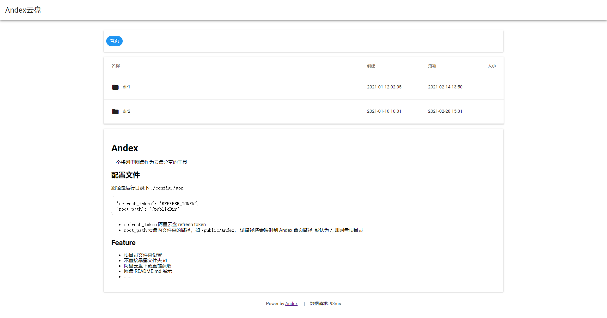
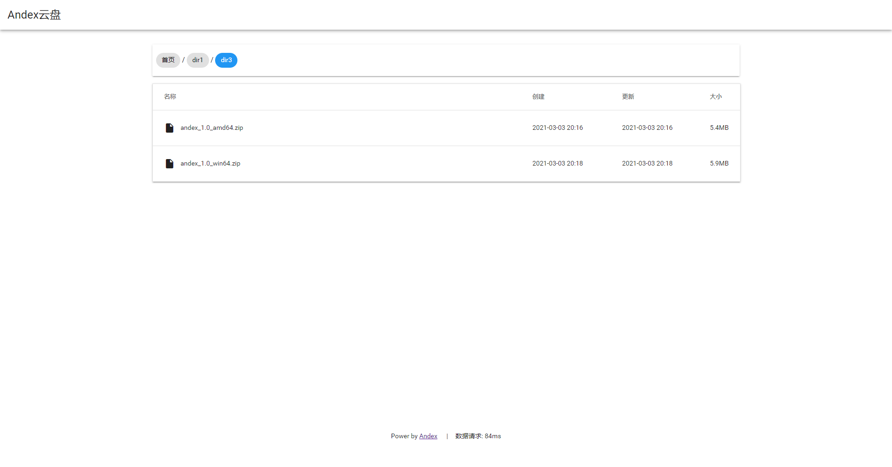
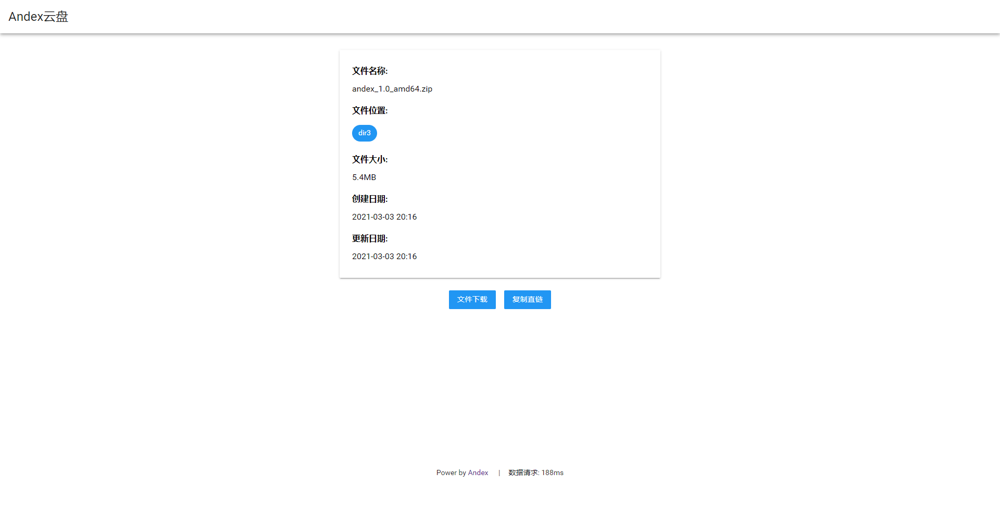

# Andex


```
 ______     __   __     _____     ______     __  __    
/\  __ \   /\ "-.\ \   /\  __-.  /\  ___\   /\_\_\_\   
\ \  __ \  \ \ \-.  \  \ \ \/\ \ \ \  __\   \/_/\_\/_  
 \ \_\ \_\  \ \_\\"\_\  \ \____-  \ \_____\   /\_\/\_\ 
  \/_/\/_/   \/_/ \/_/   \/____/   \/_____/   \/_/\/_/                                                       
```
Andex (Aliyun Index) 是一个将阿里网盘作为云盘分享的工具

## 配置文件

路径是运行目录下 `./config.json`

```json
{
  "refresh_token": "REFRESH_TOKEN",
  "root_path": "/publicDir",
  "port": "8080",
  "admin_password": "adminPassword",
  "site_name": "Andex云盘"
}
```
 - `refresh_token` 阿里云盘 refresh token，获取方法如下
    - (2021-06)
        - 打开 [这个地址](https://passport.aliyundrive.com/mini_login.htm?lang=zh_cn&appName=aliyun_drive&appEntrance=web&styleType=auto&bizParams=&notLoadSsoView=false&notKeepLogin=false&isMobile=true&hidePhoneCode=true&rnd=0.9186864872885723)
        - 输入用户名和密码，点击登录
        - login.do 的返回结果中，去除 bizExt 内容 
        - base64 解码，其中会有一个 refresh token 字段
 
 - `root_path` 云盘内文件夹的路径，如 `/public/Andex`， 该路径将会映射到 Andex 首页路径, 默认为 `/`, 即网盘根目录  

 - `port` 服务运行端口

 - `admin_password` 管理员密码

 - `site_name` 网站名称

## Feature
 - 根目录文件夹设置
 - 不直接暴露文件夹 id
 - 阿里云盘下载直链获取
 - 网盘 README.md 展示
 - 文件/文件夹下载加密(密码设置)

## TODO
 - 提供后台管理/设置/初始化页面
    - README.md 编辑
 - 文件/文件夹下载次数统计
 - ip 防护/黑名单防护
 
 ## 运行效果






